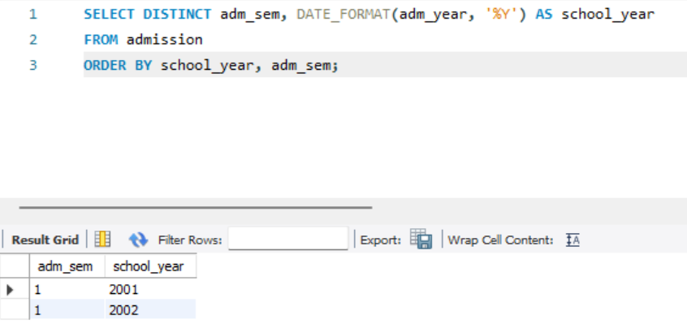

# Data-Warehouse-Labs

# TODO
- [ ] Dimensional Model
- [ ] SQL Queries per question
- [ ] Screenshot of query + output
- [ ] write-up on thoughts and experience during lab exer 2
- [ ] Discuss the difference in terms of querying in Lab Exercise #1 vs. Lab Exercise #2
- [ ] SQL Scripts (one file per question)

# 1. What is the average tuition fee

Group by the enrollment records' college ID. Querying for the average should simply follow.

# 4. How many subjects does Taylor Sheesh have?

Create a view for Taylor's information. This view's `stud_id` serves as the filter for the query in the enrollment table.

# 6. What are the combinations of semester and school year?

Using `DISTINCT` selects distinct values of `year_sem` and `year_schyr` from the `year` table, giving you the unique combinations of semester and school year.

# 7. How many students does International School of the National Artistic Arts University have?

Query the student table with a `WHERE` clause that only asks for students that have the ISNAA University in their records. 

# 10. Whose family has the least amount of money left after paying total school fees?

The base `view` serves as the central hub of all the information needed. It has the main price of their tuition fee, including miscellaneous and laboratory fees, the price of their course given that it's been multiplied to the price per unit of their college, as well as the income of their family.

the `courseTotals` aggregates all the price of the courses taken by each student, the `sum()` function was grouped accordign to the `stud_id` of each row. 

`deducts` then calculates the total deductions and the remaining money of each family in the record. In this view, querying for the least amount of money left is possible by using the `min()` function to match the lowest record.

