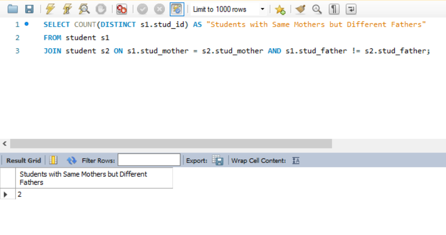

# Data-Warehouse-Labs

# TODO
- [ ] Dimensional Model
- [ ] SQL Queries per question
- [ ] Screenshot of query + output
- [ ] write-up on thoughts and experience during lab exer 2
- [ ] Discuss the difference in terms of querying in Lab Exercise #1 vs. Lab Exercise #2
- [ ] SQL Scripts (one file per question)

# 1. What is the average tuition fee?

Group by the enrollment records' college ID. Querying for the average should simply follow.

# 2. What is the average total school fees?

This directly adds all of the facts in the fact table since those refer to the school fees and then simply get the average of the sum.

# 3. How many students are enrolled per subject?

Retrieve the number of students enrolled in each subject by joining the `course` and `enrollment` tables based on the course ID. `GROUP` the results by course name and `COUNT` the distinct student IDs to determine how many students are enrolled in each subject. The results are sorted in descending order using `DESC` to show the subjects with the highest enrollment first.

# 4. How many subjects does Taylor Sheesh have?

Create a view for Taylor's information. This view's `stud_id` serves as the filter for the query in the enrollment table.

# 5. How many students have the same mother but different fathers?

This counts the number of students with the same mothers but different fathers by joining and comparing two student tables, and the DISTINCT keyword also ensures that each student is counted only once.

# 6. What are the combinations of semester and school year?

Using `DISTINCT` selects distinct values of `year_sem` and `year_schyr` from the `year` table, giving you the unique combinations of semester and school year.

# 7. How many students does International School of the National Artistic Arts University have?

Query the student table with a `WHERE` clause that only asks for students that have the ISNAA University in their records. 

# 8. How many courses are held in all the buildings?

This creates a view that selects the unique course code and building values from the course table using the DISTINCT keyword and then counts the number of courses grouped by the name of the building. 

# 10. Whose family has the least amount of money left after paying total school fees?

The base `view` serves as the central hub of all the information needed. It has the main price of their tuition fee, including miscellaneous and laboratory fees, the price of their course given that it's been multiplied to the price per unit of their college, as well as the income of their family.

the `courseTotals` aggregates all the price of the courses taken by each student, the `sum()` function was grouped accordign to the `stud_id` of each row. 

`deducts` then calculates the total deductions and the remaining money of each family in the record. In this view, querying for the least amount of money left is possible by using the `min()` function to match the lowest record.

# 11. How many courses do each professor handle?

This counts uniquely the courses they handle, which are grouped according to the professor's name from the course table.

# 12. What is the average high school grade for each school?

Calculate the average high school grade for each school by selecting `DISTINCT` school names from the `student` table. Compute the average of high school grades associated with each school using `AVG()`. Sort the results in descending order based on the average high school grade using `DESC`.

