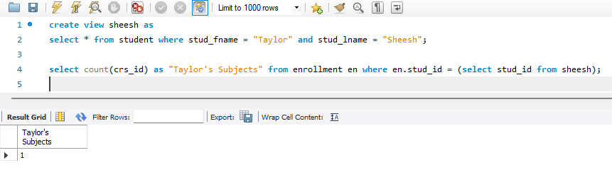
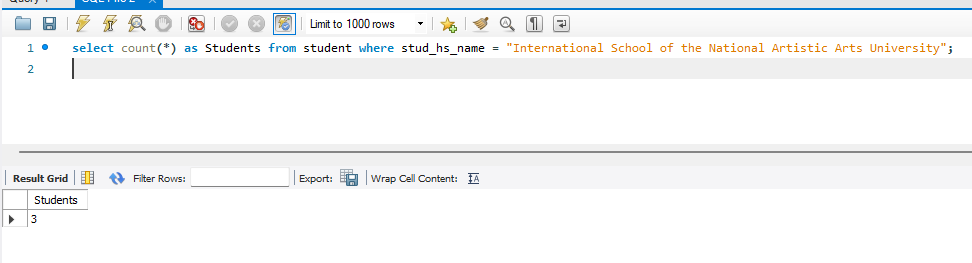
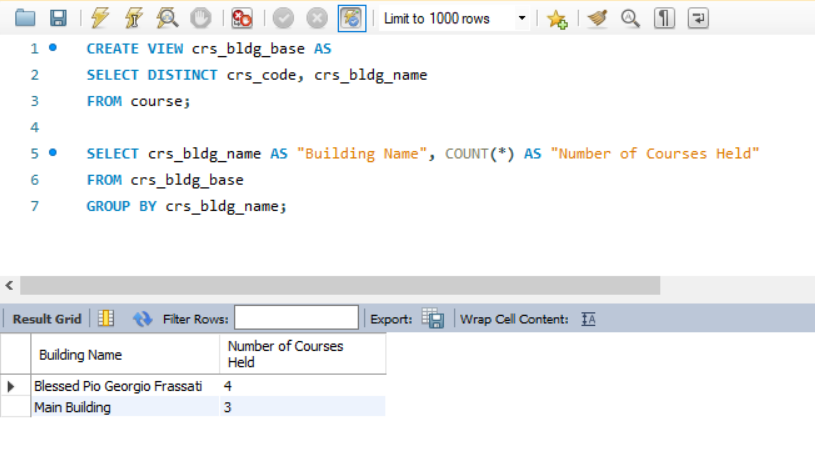
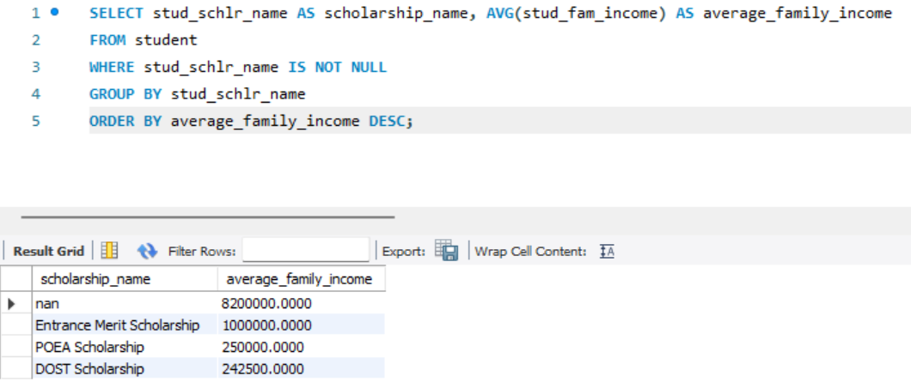
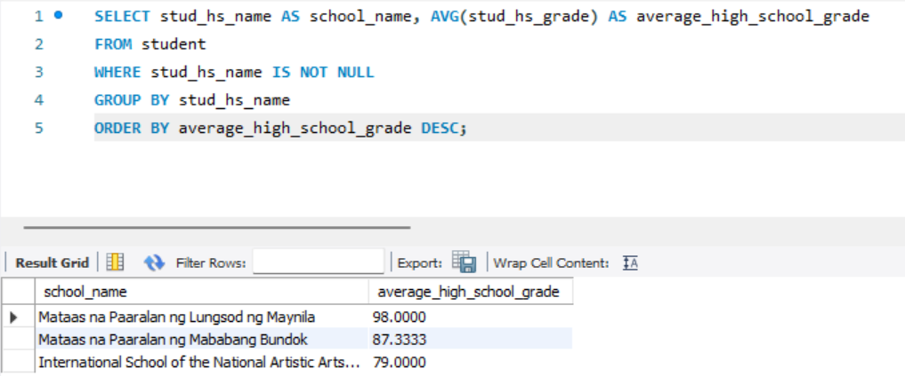

# Archived Version of Lab Exercise 1

This branch is created as an orphan (i.e. all past commits are disregarded but all the files are transferred here) of the main branch upon finishing Lab Exercise #1. Do not touch this branch as it serves as the repository archive of the activity. 

# Data-Warehouse-Labs

### 1NF 

Attributes would stay the same, there are no duplicate records and each record had an atomic value per attribute

### 2NF

Chose the approach of creating a unique primary key for each record to remove the necessity of 2NF for composite keys

### 3NF

> a combination of aly's 3nf and andy's 3nf

split the original table into these entities
- student
- bio
- location
- application
- family
- scholarship
- highschool
- admission
- program
- college
- course
- year
- building
- tuition

# Questions

### 1. What is the Average tuition fee

> put some explanation here

### 2. What is the average total school fees?

Using the SUM will add the various components of school fees and grouping it by Student ID will make it one row per student, and using the AVG will get the average total school fees in general

### 3. How many students are enrolled per subject?

### 4. How many subjects does Taylor Sheesh have?

By using the `distinct` keyword to only get the courses that are connected to Taylor Sheesh's bio_id, we can acquire the count

### 5. How many students have the same mother but different fathers?

Doing a self-join on family table created two instances to check if they have the same mother but different fathers with the help of the DISTINCT keyword to help eliminate duplicates

### 6. What are the combinations of semester and school year?

### 7. How many students does Intemational School of the National Artistic Arts University have?

The I.S.N.A.A.U. has a total of 4 unique students in the database

### 8. How many courses are held in all the buildings?

Two views were created: (1) For joining the course and building tables and (2) For eliminating duplicates, then it counted the courses per building it is being held

### 9. What is the average family income per scholarship?

### 10. Whose family has the least amount of money left after paying total school fees?

### 11. How many courses do each professor handle?

A view was created using the DISTINCT keyword to eliminate duplicate values and be used as the basis for counting the courses each professor handles

### 12. What is the average high school grade for each school?

